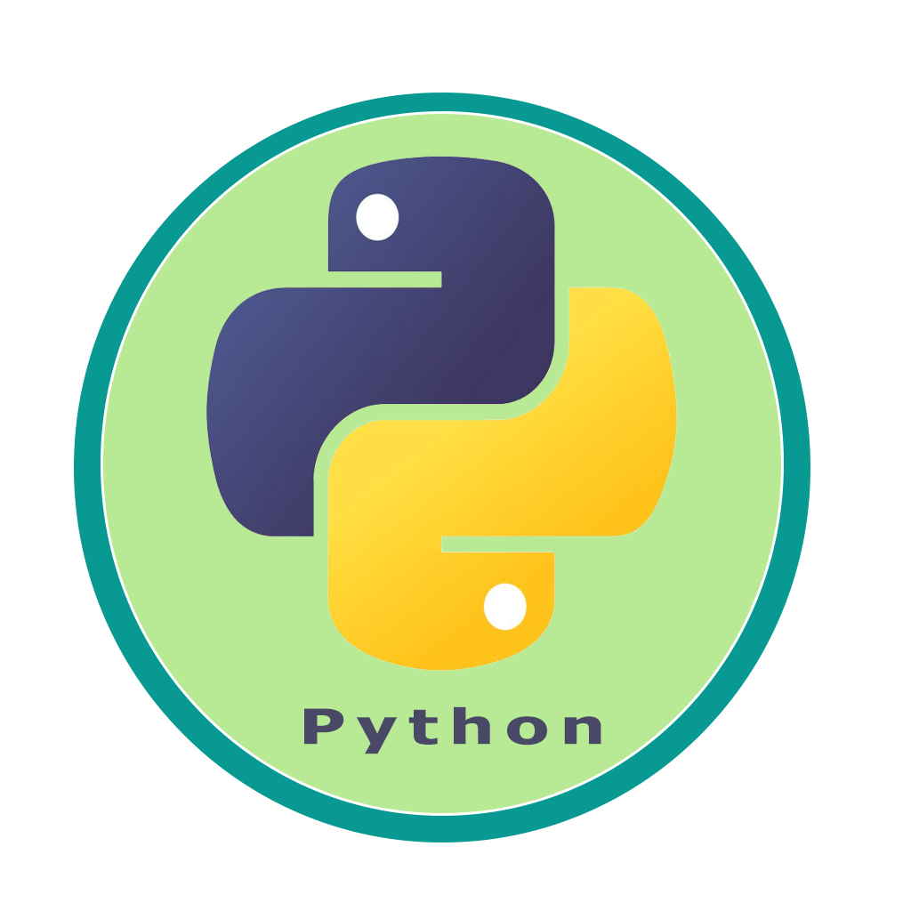

### Hi, i'm Hana Toumanari 👋
<h3 align="center">Cybersecurity Engineering student | Purple-Hat</h3> 

> ### 🖥️  See my linkedin Profile at [Linkedin](https://www.linkedin.com/in/hana-toumanari-53a3431a3/) 
> ### ✉️  My e-mail : toumanarihanaa@gmail.com 
 > ### - "How do we get ahead of crazy if we don't know how crazy thinks?" -Mindhunter  
  
               
<h2 center="align">PURPLE HAT </h2>
 

  
  

  ### Languages and Tools:
  
  
  
  
  
  
  
  
  
  
  

<!--
**HANATM/HANATM** is a ✨ _special_ ✨ repository because its `README.md` (this file) appears on your GitHub profile.

Here are some ideas to get you started:

- 🔭 I’m currently working on 
- 🌱 I’m currently learning ...
- 👯 I’m looking to collaborate on ...
- 🤔 I’m looking for help with ...
- 💬 Ask me about ...
- 📫 How to reach me: ...
- 😄 Pronouns: ...
- ⚡ Fun fact: ...
-->
